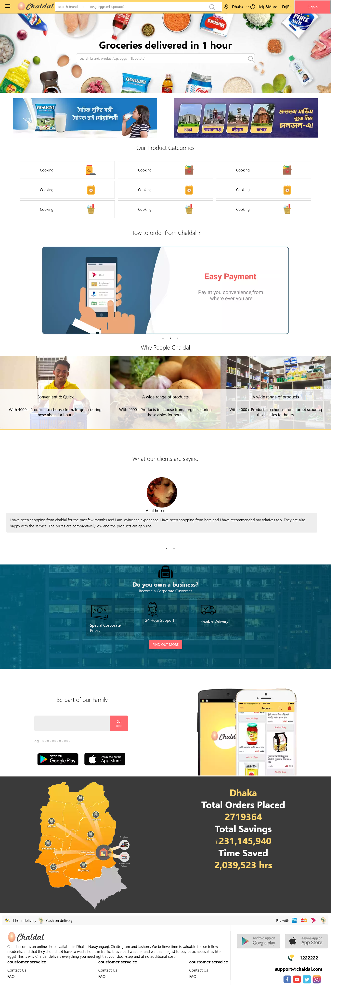
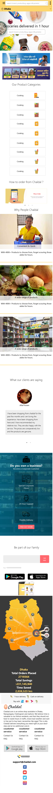

# Getting Started with Create React App

This project was bootstrapped with [Create React App](https://github.com/facebook/create-react-app).

## Available Scripts

In the project directory, you can run:

### `npm start`

Runs the app in the development mode.\
Open [http://localhost:3000](http://localhost:3000) to view it in the browser.

### `npm run build`

Builds the app for production to the `build` folder.\
It correctly bundles React in production mode and optimizes the build for the best performance.

See the section about [deployment](https://chaldal-landing-page-clone.netlify.app/) for more information.

### `Description`

Bangladeshi popular online shop chaldal landing page clone with react.js, HTML, CSS. This was my job first task for me. 

## 📸 Screenshots :

**Fullview** :   

**Mobileview** :   

/src/assets/

### Deployment

This section has moved here: (https://chaldal-landing-page-clone.netlify.app/) 

### `Contact with me anytime`
**Protfolio:(https://www.altafhosen.com/)**
**E-mail:altafhm2000@gmail.com**
**Linkedin:(https://www.linkedin.com/in/hosen-md-altaf-06922a15a/)**
**Facebook:(https://www.facebook.com/profile.php?id=100008099341022)**
